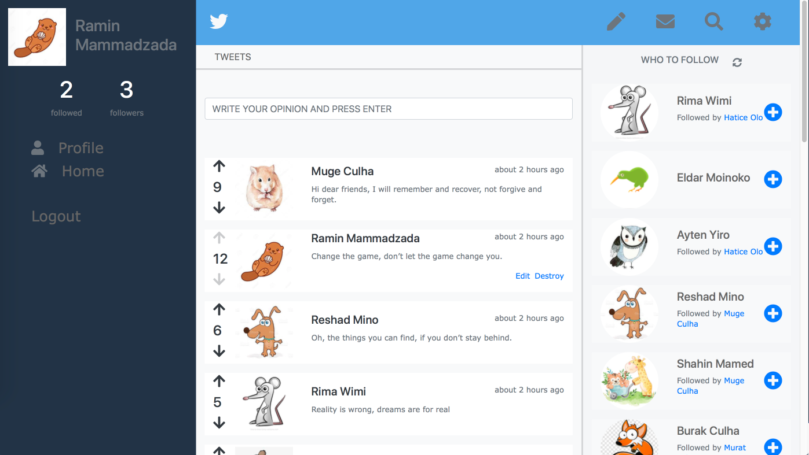
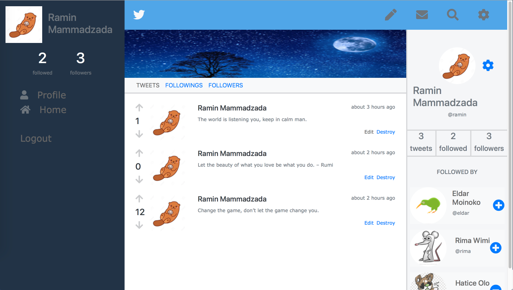
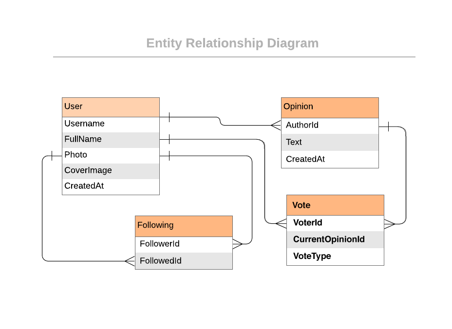

# Microverse > Ruby on Rails Capstone > Twitter Redesign


## Project specification
In the project I built a fullstack application on Ruby on Rails which is a based 
on a redesign of Twitter. I followed the [given design of the website](https://www.behance.net/gallery/14286087/Twitter-Redesign-of-UI-details), 
but personalized the content and introduced voting to the tweets ( or opinions ). 


Homepage


Userpage

## MVP version of the app
I followed a user journey to build the following **MVP version** of the app:

1. The user logs in to the app, only by typing the username (a proper authenticated login is **not** a requirement).
2. The user is presented with the homepage (see the *Homepage* screenshot above) that includes:
    1. Left-side menu (includes only links to pages that are implemented).
    2. *Tweets* tab in the centre (skip *Photos* and *Videos* for this MVP).
    3. Right-side section with *Who to follow (*skip *Trending for* this MVP).
3. The *Tweets* section includes:
    1. Simple form for creating a tweet.
    2. List of all tweets (sorted by most recent) that display tweet text and author details.
4. The *Who to follow* section includes:
    1. List of profiles that are not followed by the logged-in user (ordered by most recently added).
5. When the user opens the profile page (see the *Userpage* screenshot above), they can see:
    1. Left-side menu (includes only links to pages that are implemented).
    2. Cover picture and *Tweets* tab in the centre (skipped other tabs and *Tweet to user* form).
    3. Right-side section with *Profile detailed info.*
6. The *Profile detailed info* section includes:
    1. User photo.
    2. Button to follow a user.
    3. Stats: total number of tweets, number of followers and number of following users.
    4. List of people who follow this user.
7. At the end extend the MVP app with one simple voting feature is created.

8. Eager loading is implemented in the controllers to avoid ```n+1 queries``` problem. 


## Technical mandatory requirements of the project:
1. The project is a desktop web app.
2. The database schema should reflect the following structure:

    

3. It validates all user input to make sure that anyone with bad intentions cannot compromise your app.
4. It uses Postgres as your database.
5. It uses ```.erb``` view template engine of your choice.
6. It is an MVP of the full product (with the full graphical design but only basic features that can be easily extended in the future).
7. The project is deployed and accessible online.


## Live Demo
- [Live demo link with Heroku](https://whispering-headland-84892.herokuapp.com)

## Video presentation
- 

## Built With

- Ruby v2.7.0p0
- Ruby on Rails v6.0.3.4
- Node v13.7.0
- npm v6.13.6

## Getting Started

To get a local copy up and running follow these simple example steps.

### Install
In order to run, you need to install RUBY and Rails in your computer. For windows you can go to [Ruby installer](https://rubyinstaller.org/) and for MAC and LINUX you can go to [Ruby official site](https://www.ruby-lang.org/en/downloads/) for intructions on how to intall it.

Then you can clone the project by typing ```https://github.com/jurgen1c/ror-social-scaffold/tree/fb-friendship-v1```

### Dependencies
You must install the dependendies by bundling the Gemfile:
   - First fo the root of the project by typing ```cd rails-twitter-redesign```
   - Go to the ```develop``` branch by typing ```git checkout feature```
   - ```gem install bundler```
   - ```bundle update```
   - ```bundle install``

### Prerequisites

Ruby: 2.6.3
Rails: 5.2.3
Postgres: >=9.5

### Setup

Instal gems with:

```
bundle install
```

Setup database with:

```
   rails db:create
   rails db:migrate
```

### Github Actions

To make sure the linters' checks using Github Actions work properly, you should follow the next steps:

1. On your recently forked repo, enable the GitHub Actions in the Actions tab.
2. Create the `feature/branch` and push.
3. Start working on your milestone as usual.
4. Open a PR from the `feature/branch` when your work is done.


### Usage

Start server with:

```
    rails server
```

Open `http://localhost:3000/` in your browser.

### Run tests

```
    rpsec --format documentation
```

## Authors

👤 **Ramin Mammadzada**

- Github: [@RaminMammadzada](https://github.com/RaminMammadzada)
- Twitter: [@RaminMammadzada](https://twitter.com/RaminMammadzada)
- Linkedin: [@RaminMammadzada](https://www.linkedin.com/in/raminmammadzada) 


## 🤝 Contributing

Contributions, issues and feature requests are welcome!

Feel free to check the [issues page](issues/).

## Show your support

Give a ⭐️ if you like this project!

## Acknowledgments

Microverse

## 📝 License

This project is [MIT](lic.url) licensed.

